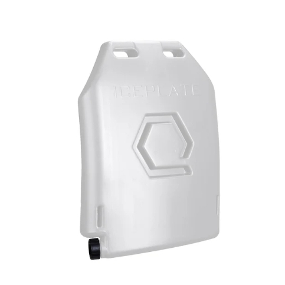
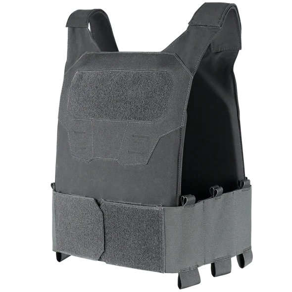
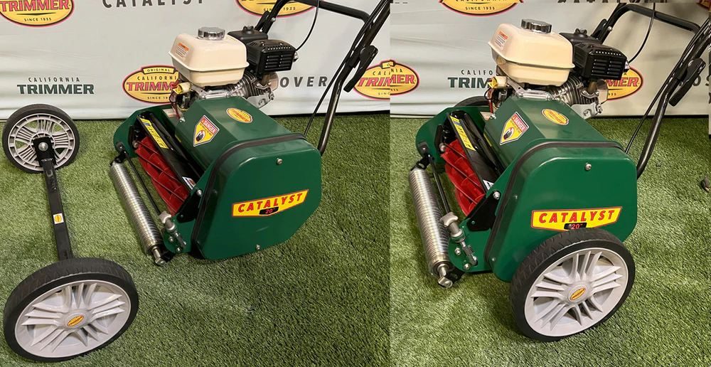

# Mowing Tips

## Table of Contents
- [Beat The Heat](#beat-the-heat-️)
  - [Stay Cool with ICEPLATE](#stay-cool-with-iceplate)
  - [Mow Early — And Light the Way](#mow-early--and-light-the-way-)
  - [Keep the Mosquitoes Away](#keep-the-mosquitoes-away-)
- [Operation](#operation)
  - [Transport Wheel Kit](#transport-wheel-kit-️)
  - [Track Your Engine Hours](#track-your-engine-hours-️)
  - [Pull Starting Your Small Engine](#pro-tip-youre-pull-starting-your-small-engine-wrong-)

## Beat The Heat ☀️

Summer mowing can be brutal. Here are a couple of tips to help you stay cool and safe.

### Stay Cool with ICEPLATE

The [**ICEPLATE Curve**](https://www.qoreperformance.com/collections/iceplate-featured/products/iceplate?variant=39422173479027) by Qore Performance is like your own portable A/C. Fill it with water, freeze it overnight, and wear it against your body while you mow. It keeps you cool for hours. **Buy two** to keep you extra cool — stay cool for a whole mowing session.

You'll need a **plate carrier** to hold the ICEPLATE against your chest. The [**Condor Specter Plate Carrier**](https://condoroutdoor.com/products/condor-specter-plate-carrier?variant=44504235540631) (~$73) is a great match — it's thin, low-profile, and doesn't look overly tactical for mowing the lawn:

- 🪶 **Ultra-lightweight & minimalist** — 4-way stretch nylon, no bulky MOLLE webbing or heavy padding
- 🌬️ **Breathable** — thin construction with good airflow, important when you're already fighting the heat
- 🧼 **Easy to wash** — simple nylon, hand wash or gentle machine cycle
- 📐 **Fits ICEPLATE** — accepts 10" x 12" plates up to ~3/4" thick (front and back), adjustable cummerbund fits 34"–48"

**Where to buy:**
- [Condor Outdoor (Official) — $63.95](https://condoroutdoor.com/products/condor-specter-plate-carrier?variant=44504235540631)
- [Amazon — Condor Specter Plate Carrier](https://www.amazon.com/dp/B0948VCRJ5)
- [eBay — Condor Specter Plate Carrier](https://www.ebay.com/shop/condor-plate-carrier?_nkw=condor+specter+plate+carrier)

### Mow Early — And Light the Way 🔦

To beat the heat, mow early in the morning before the sun is up. But you still need to see where you're going! The [**OYOCO 30W Rechargeable LED Work Light**](https://www.amazon.com/dp/B06X3WLVKJ) has a magnetic base that sits right on top of the metal base of the mower and casts a wide, bright (but not blinding) light. It's rechargeable, so no cords to worry about.

- 🧲 Magnetic base — attaches directly to the mower
- 🔋 Rechargeable battery — up to 9 hours of runtime
- 💡 1200 lumens with adjustable brightness (30% / 100%)
- 💧 Waterproof — no worries about morning dew

### Keep the Mosquitoes Away 🦟

Dawn and dusk are prime mosquito hours — exactly when you're out mowing to beat the heat. Grab a [**Mosquito Net Hat with UPF 50+ Sun Protection**](https://www.amazon.com/dp/B0G6KW2J1T) — get it in **black** netting so it's easier to see through. It shields your face and neck from bugs while also blocking 98% of harmful UV rays.

## Operation

### Transport Wheel Kit 🛞

A not-so-obvious accessory — the [**Transport Wheel Kit**](https://caltrimmer.com/products/transport-wheel-kit-catalyst) ($179.99) from California Trimmer. These mowers are **not** lightweight — even just moving one from one side of the garage to the other can be more work than it needs to be:

| Model | Weight (7-Blade, No Catcher) | Grass Catcher | Catcher Weight |
|---|---|---|---|
| LC20 (Briggs) | 183 lbs (83 kg) | 20 gal (75 L) | 11 lbs (5 kg) |
| LC20 (Honda) | 187 lbs (85 kg) | 20 gal (75 L) | 11 lbs (5 kg) |
| LC25 (Honda) | 218 lbs (99 kg) | 24 gal (90 L) | 15 lbs (7 kg) |

Rolling nearly 200 lbs in and out of the garage, to the truck, or across the yard multiple times a year on the rubber rear drums isn't ideal. It wears them down and spins the reel dry without lubrication. The transport wheels let you move the mower short distances without running the engine or grinding the reel.

### Track Your Engine Hours ⏱️

The maintenance schedule is based on engine hours, but the Catalyst doesn't come with an hour meter. Add an inexpensive **inductive hour meter** — it wraps around the spark plug wire and automatically tracks runtime. This way you'll always know when it's time for an oil change or to grease the bearings.

**Where to buy:**
- [Amazon — Magicalmai Inductive Hour Meter (~$10)](https://www.amazon.com/dp/B07Y3ZYBLW)
- [Walmart — Inductive Hour Meters for Small Engines](https://www.walmart.com/c/kp/hour-meters-small-engines)
- [Home Depot — EKIEUDL Digital Inductive Tach Hour Meter](https://www.homedepot.com/p/EKIEUDL-Digital-Inductive-Tach-Hour-Meter-RPM-Gauge-Lawn-Mower-Scooter-Dirt-Bike-Tractor-Generator-Marine-Motorcycle-Snowblower-EE182PH012/337969430)

### Pro Tip: You're Pull Starting Your Small Engine Wrong 🎬

Most people pull start their mower the wrong way. This YouTube video by **Silver Cymbal** shows a simple change that makes starting easier, safer, and won't damage your engine.

#### Official Honda GX160 Recoil Starter Procedure

Honda's own manuals for the GX160 (the engine in the Catalyst) confirm the correct technique:

1. Pull the starter grip **lightly until you feel resistance** (this takes up slack and engages the mechanism)
2. Then pull **briskly** — a sharp, full pull in the indicated direction
3. **Return the grip gently** by hand — do **not** let it snap back against the engine, as this damages the recoil starter assembly over time

> *"Pull the starter grip lightly until you feel resistance, then pull briskly."*
> *"Return the starter grip gently. Do not allow the starter grip to snap back against the engine."*
> — Honda GX120/GX160/GX200 Owner's Manual

**Official Honda engine manuals (PDF):**
- [37Z4F605 — GX160 Owner's Manual (EN/FR/ES)](https://cdn.powerequipment.honda.com/engines/pdf/manuals/37Z4F605.pdf)
- [31ZH7600 — GX160 Owner's Manual (older version)](https://cdn.powerequipment.honda.com/engines/pdf/manuals/31ZH7600.pdf)
